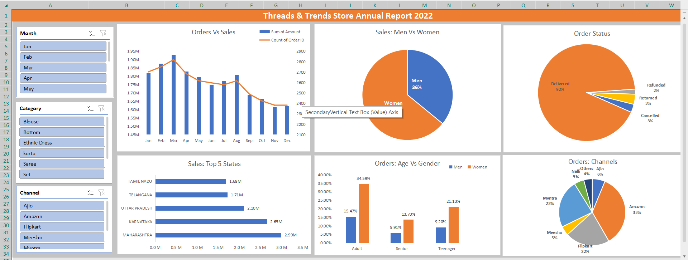

# Excel Dashboard: Threads & Trends Store Annual Report 2022

## Overview
This Excel Dashboard provides an interactive and visually appealing representation of the annual performance of the Threads & Trends store for 2022. It is designed to offer actionable insights into sales, orders, and customer demographics through advanced data visualization techniques.

## Features
- **Interactive Filters**: Filter data by month, category, and sales channels.
- **Order vs Sales Analysis**: Compare order counts and sales revenue trends using dynamic charts.
- **Customer Demographics**: Visualize sales distribution by gender and age group.
- **Order Status Insights**: Breakdown of delivered, canceled, refunded, and returned orders.
- **Regional Performance**: Highlight top-performing states in sales.
- **Channel Performance**: Analyze sales contribution from various platforms like Amazon, Flipkart, and others.

## Tools and Techniques Used
- Microsoft Excel 365
- Pivot Tables and Pivot Charts
- Slicers for Interactive Filters
- Dynamic Data Visualization (Bar Charts, Pie Charts, Line Charts)
- Data Cleaning and Formatting

## How to Use
1. Open the Excel file in Microsoft Excel 365 or later.
2. Use the slicers on the left panel to filter data by:
   - **Month**
   - **Category**
   - **Sales Channel**
3. Observe changes across all charts to gain insights into the selected data.

## Key Insights
- **Revenue Trends**: The store's highest sales occurred in [Month].
- **Gender Analysis**: Women contribute to 64% of sales, with men at 36%.
- **Top States**: Maharashtra leads in sales, followed by Karnataka and Uttar Pradesh.
- **Channel Analysis**: Amazon is the top-performing platform with 35% of total sales.

## Preview

## Future Improvements
- Integrating VBA macros for automation.
- Adding forecasting features using historical data.
- Exporting visualizations to PDF with a single click.
